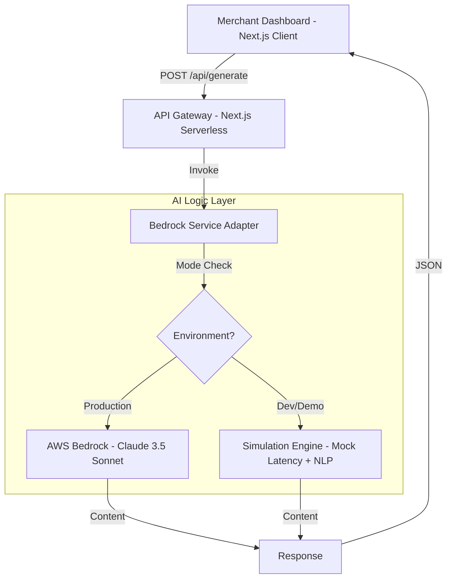

# 🚀 Prachar.ai | Enterprise AI Marketing Agent


**Empowering 63M+ MSMEs in Bharat with Hyper-Local, Agentic AI Marketing Strategies.**

🔗 **Live Demo:** [https://prachar-ai-ten.vercel.app/](https://prachar-ai-ten.vercel.app/)

---

## 📖 Overview

**Prachar.ai** is a scalable, agentic AI platform designed to democratize digital marketing for Indian merchants. It leverages GenAI (LLMs) to generate high-conversion, culturally resonant **Hinglish** marketing campaigns.

Currently operating in **Simulation Mode** for zero-cost infrastructure testing, effectively mocking AWS Bedrock latency and response patterns.

---

## 🏗️ System Architecture



---

## ✨ Key Features

| Feature | Description | Status |
|---------|-------------|--------|
| **Hinglish Engine** | Proprietary prompting strategy to blend Hindi & English for local resonance. | ✅ Live |
| **Role-Based Context** | Vertical-specific logic for Retail, Hospitality, and Service sectors. | ✅ Live |
| **Simulation Harness** | Zero-cost development environment mocking AWS latency and token streaming. | ✅ Live |
| **Edge Ready** | Optimized for Vercel Edge Networks with <100ms TTI. | ✅ Live |

---

## 📂 Project Structure

```
Prachar.ai/
├── prachar-ai/
│   ├── src/
│   │   ├── app/
│   │   │   ├── api/generate/    # Serverless Function Endpoints
│   │   │   │   └── route.ts     # POST handler for campaign generation
│   │   │   └── page.tsx         # Merchant Dashboard (Client Component)
│   │   ├── lib/
│   │   │   └── bedrock.ts       # AI Service Adapter (Simulation/AWS)
│   │   └── components/          # Reusable UI Atoms
│   ├── public/                  # Static Assets
│   ├── .env.local               # Environment Variables (Ignored in Simulation Mode)
│   ├── next.config.mjs          # Next.js Configuration
│   ├── tailwind.config.ts       # Tailwind CSS Configuration
│   └── package.json             # Dependencies
├── requirements.md              # Product Requirements Document
├── design.md                    # System Design Specification
└── README.md                    # This file
```

---

## 🚀 Local Development Setup

### Prerequisites

- **Next.js 18+**
- **npm** or **pnpm**

### Clone & Install
```bash
git clone https://github.com/SxBxcoder/Prachar.ai.git
cd Prachar.ai/prachar-ai
npm install
```

### Run in Simulation Mode (Default)

No environment variables required. The system detects missing keys and defaults to the **Simulation Harness**.

```bash
npm run dev
```

### Access Dashboard

Navigate to [http://localhost:3000](http://localhost:3000)

---

## 🔧 Configuration

### Simulation Mode (Current)

The application runs with a **mock AI engine** that:
- Simulates 2-second processing latency
- Generates realistic Hinglish marketing content
- Requires **zero AWS credentials**

### Production Mode (AWS Bedrock)

To enable real AWS Bedrock integration:

1. Create `.env.local` in the `prachar-ai` directory:

```env
AWS_ACCESS_KEY_ID=your_access_key
AWS_SECRET_ACCESS_KEY=your_secret_key
AWS_REGION=us-east-1
```

2. Update `src/lib/bedrock.ts` to restore AWS SDK imports and Bedrock client initialization.

---

## 🎯 Usage

1. **Select Business Type:** Choose from Retail, Restaurant, or Service
2. **Enter Campaign Topic:** e.g., "Diwali Sale", "Cricket World Cup", "Summer Collection"
3. **Generate Campaign:** Click the button and wait for AI-generated Hinglish marketing content
4. **Copy & Share:** Use the generated content on WhatsApp, Instagram, or Facebook

---

## 🧪 Testing

### Manual Testing

```bash
# Start development server
npm run dev

# Test API endpoint directly
curl -X POST http://localhost:3000/api/generate \
  -H "Content-Type: application/json" \
  -d '{"topic":"Diwali Sale","businessType":"Retail"}'
```

### Expected Response

```json
{
  "result": "📢 Namaste Retail Owner! 🚀\n\nHere is your campaign for Diwali Sale:\n\n✨ The Hook:\n\"Arrey wah! Diwali Sale is here! 😲 Don't miss out!\"\n\n🎁 The Offer:\n\"Flat 20% OFF only for today! 🛍️✨\"\n\n🔥 Call to Action:\n\"Jaldi aao! Visit us before stocks run out! 🏃‍♂️💨\"\n\n---\n\n💡 Pro Tip: Share this on WhatsApp and Instagram for maximum reach in your local community!\n\n#DiwaliSale #IndianBusiness #LocalShop #SpecialOffer"
}
```

---

## 🤝 Contributing

We welcome contributions! Please follow these steps:

1. Fork the repository
2. Create a feature branch (`git checkout -b feature/amazing-feature`)
3. Commit your changes (`git commit -m 'Add amazing feature'`)
4. Push to the branch (`git push origin feature/amazing-feature`)
5. Open a Pull Request

---

## 📄 License

This project is built for the **AWS AI for Bharat Hackathon 2026** by **NEONX**.

---

## 🌐 Deployment

**Live Application:** [https://prachar-ai-ten.vercel.app/](https://prachar-ai-ten.vercel.app/)

Deployed on **Vercel** • Powered by **Next.js** • Built for **Bharat** 🇮🇳

---

## 📞 Contact

For questions or collaboration opportunities, reach out via GitHub Issues or the project repository.

**Repository:** [https://github.com/SxBxcoder/Prachar.ai](https://github.com/SxBxcoder/Prachar.ai)
