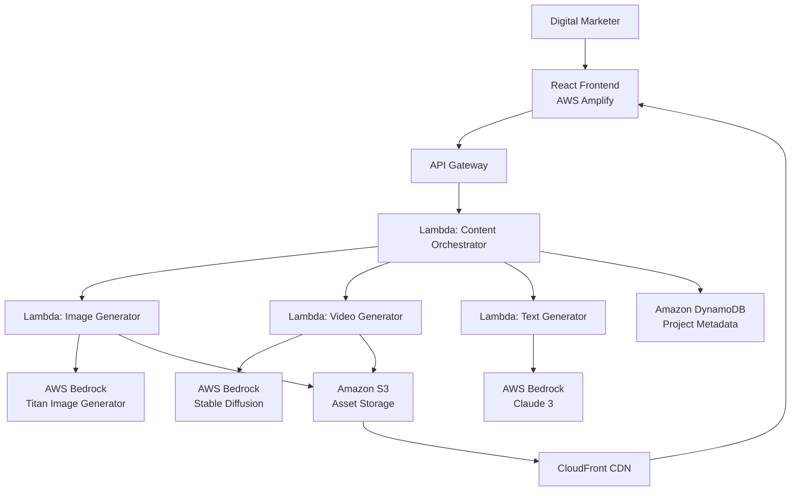

# Design Document: ContentGenie-AWS

## Overview

ContentGenie-AWS is a serverless AI-powered content generation platform built on AWS infrastructure. The system leverages AWS Bedrock for AI generation (Titan Image Generator and Claude 3), Amazon S3 for asset storage, DynamoDB for metadata persistence, and AWS Amplify for frontend hosting. The architecture follows a serverless pattern using AWS Lambda functions to orchestrate content generation workflows.

The platform accepts text prompts from digital marketers and generates multiple marketing assets in parallel: 3 image variations, video clips/GIFs, platform-specific captions (Instagram and LinkedIn), and hashtags. Users can edit generated content, download assets individually or in bulk, and access their project history for reuse.

### Key Design Principles

1. **Serverless Architecture**: Minimize operational overhead using managed AWS services
2. **Parallel Generation**: Generate all asset types concurrently to reduce latency
3. **Platform Optimization**: Tailor content for specific social media platforms (Instagram, LinkedIn)
4. **Graceful Degradation**: Handle partial failures without blocking the entire workflow
5. **Cost Efficiency**: Use S3 lifecycle policies and appropriate storage tiers

## Architecture

### High-Level Architecture



### Component Interaction Flow

1. **User submits text prompt** → Frontend validates input (min 3 characters)
2. **Frontend calls API Gateway** → Routes to Content Orchestrator Lambda
3. **Orchestrator validates prompt** → Creates Project record in DynamoDB
4. **Orchestrator invokes generators in parallel**:
   - Image Generator Lambda (3 variations)
   - Video Generator Lambda (1 clip/GIF)
   - Text Generator Lambda (captions + hashtags)
5. **Each generator**:
   - Calls AWS Bedrock API with retry logic
   - Stores assets in S3 (images/videos) or returns text directly
   - Returns asset references/content to Orchestrator
6. **Orchestrator aggregates results** → Updates Project in DynamoDB
7. **Orchestrator returns response** → Frontend displays all assets
8. **User interacts with assets** → Edit, download, or save to history

### AWS Service Selection Rationale

- **AWS Bedrock**: Managed AI service eliminates model hosting complexity, provides multiple foundation models (Titan, Claude 3), handles scaling automatically
- **Amazon S3**: Durable object storage for images/videos, supports lifecycle policies for cost optimization, integrates with CloudFront for fast delivery
- **DynamoDB**: Serverless NoSQL database for project metadata, provides single-digit millisecond latency, scales automatically
- **AWS Lambda**: Serverless compute for orchestration and generation logic, pay-per-use pricing, automatic scaling
- **API Gateway**: Managed REST API with built-in throttling, authentication support, and request validation
- **AWS Amplify**: Simplified frontend hosting with CI/CD, CDN distribution, and custom domain support

## Components and Interfaces

### Frontend Component (React + AWS Amplify)

**Responsibilities**:
- Render user interface for prompt input, asset display, editing, and download
- Validate user input before API calls
- Display loading states during generation
- Handle error messages and retry logic
- Manage local state for editing operations

**Key Modules**:
- `PromptInput`: Text input with validation (min 3 chars)
- `AssetGallery`: Display grid for images, videos, captions, hashtags
- `AssetEditor`: Inline editing interface for captions, hashtags, and basic image operations
- `ProjectHistory`: List view of past projects with search/filter
- `DownloadManager`: Handle single and bulk downloads

**API Integration**:
```typescript
interface ContentGenerationRequest {
  prompt: string;
  userId: string;
  platforms: ('instagram' | 'linkedin')[];
}

interface ContentGenerationResponse {
  projectId: string;
  images: ImageAsset[];
  videos: VideoAsset[];
  captions: CaptionSet;
  hashtags: HashtagSet;
  status: 'complete' | 'partial' | 'failed';
  errors?: GenerationError[];
}

interface ImageAsset {
  assetId: string;
  s3Key: string;
  s3Url: string;
  thumbnailUrl: string;
  dimensions: { width: number; height: number };
  platform: 'instagram' | 'linkedin';
}

interface VideoAsset {
  assetId: string;
  s3Key: string;
  s3Url: string;
  duration: number;
  format: 'mp4' | 'gif';
}

interface CaptionSet {
  instagram: string[];
  linkedin: string[];
}

interface HashtagSet {
  instagram: string[];
  linkedin: string[];
}
```

### API Gateway

**Endpoints**:
- `POST /generate` - Generate content from text prompt
- `GET /projects` - Retrieve user's project history
- `GET /projects/{projectId}` - Retrieve specific project details
- `PUT /projects/{projectId}/assets/{assetId}` - Update edited asset
- `GET /download/{assetId}` - Download single asset
- `POST /download/bulk` - Download multiple assets as ZIP

**Authentication**: AWS Cognito integration for user identity management

**Request Validation**:
- Prompt length: 3-1000 characters
- User ID: Required, valid UUID format
- Platform selection: At least one platform required

### Content Orchestrator Lambda

**Responsibilities**:
- Validate incoming requests
- Create Project record in DynamoDB
- Invoke generation Lambdas in parallel using async invocation
- Aggregate results from all generators
- Handle partial failures gracefully
- Update Project record with final results

**Pseudocode**:
```
function handleContentGeneration(request):
  // Validate input
  if request.prompt.length < 3:
    return error("Prompt too short")
  
  // Create project record
  projectId = generateUUID()
  project = {
    projectId: projectId,
    userId: request.userId,
    prompt: request.prompt,
    createdAt: currentTimestamp(),
    status: "generating"
  }
  dynamoDB.putItem(project)
  
  // Invoke generators in parallel
  imagePromise = invokeAsync(ImageGeneratorLambda, {
    prompt: request.prompt,
    projectId: projectId,
    count: 3,
    platforms: request.platforms
  })
  
  videoPromise = invokeAsync(VideoGeneratorLambda, {
    prompt: request.prompt,
    projectId: projectId
  })
  
  textPromise = invokeAsync(TextGeneratorLambda, {
    prompt: request.prompt,
    platforms: request.platforms
  })
  
  // Wait for all with timeout
  results = awaitAll([imagePromise, videoPromise, textPromise], timeout=30s)
  
  // Aggregate results
  response = {
    projectId: projectId,
    images: results.images || [],
    videos: results.videos || [],
    captions: results.captions || {},
    hashtags: results.hashtags || {},
    status: determineStatus(results),
    errors: collectErrors(results)
  }
  
  // Update project with results
  dynamoDB.updateItem(projectId, {
    status: response.status,
    assets: response,
    completedAt: currentTimestamp()
  })
  
  return response
```

**Error Handling**:
- If all generators fail: Return error status with details
- If some generators fail: Return partial results with warnings
- If DynamoDB write fails: Log error but still return generated content
- Timeout handling: 30-second timeout for all parallel operations

### Image Generator Lambda

**Responsibilities**:
- Call AWS Bedrock Titan Image Generator API
- Generate 3 image variations per prompt
- Optimize dimensions for target platforms
- Store images in S3 with organized key structure
- Generate thumbnail versions for preview
- Implement retry logic with exponential backoff

**Pseudocode**:
```
function generateImages(prompt, projectId, count, platforms):
  images = []
  
  for i in range(count):
    for platform in platforms:
      dimensions = getPlatformDimensions(platform)
      
      // Call Bedrock with retry
      retries = 0
      while retries < 3:
        try:
          imageData = bedrockClient.invokeModel(
            modelId: "amazon.titan-image-generator-v1",
            body: {
              textToImageParams: {
                text: prompt
              },
              imageGenerationConfig: {
                width: dimensions.width,
                height: dimensions.height,
                numberOfImages: 1,
                quality: "premium"
              }
            }
          )
          break
        catch RateLimitError:
          retries++
          sleep(exponentialBackoff(retries))
        catch error:
          log(error)
          if retries >= 2:
            return error
          retries++
      
      // Store in S3
      s3Key = `users/${userId}/projects/${projectId}/images/${platform}_${i}.png`
      s3.putObject(bucket, s3Key, imageData)
      
      // Generate thumbnail
      thumbnail = resizeImage(imageData, maxWidth=300)
      thumbnailKey = `${s3Key}_thumb.png`
      s3.putObject(bucket, thumbnailKey, thumbnail)
      
      // Generate presigned URL
      imageUrl = s3.generatePresignedUrl(s3Key, expiresIn=3600)
      thumbnailUrl = s3.generatePresignedUrl(thumbnailKey, expiresIn=3600)
      
      images.append({
        assetId: generateUUID(),
        s3Key: s3Key,
        s3Url: imageUrl,
        thumbnailUrl: thumbnailUrl,
        dimensions: dimensions,
        platform: platform
      })
  
  return images

function getPlatformDimensions(platform):
  if platform == "instagram":
    return {width: 1080, height: 1080}  // Square format
  else if platform == "linkedin":
    return {width: 1200, height: 627}   // Landscape format
```

**Retry Strategy**:
- Max retries: 3
- Backoff: 2^retry * 100ms (100ms, 200ms, 400ms)
- Retry on: Rate limit errors, transient network errors
- No retry on: Invalid input, authentication errors

### Video Generator Lambda

**Responsibilities**:
- Generate short video clips or GIFs (3-10 seconds)
- Call AWS Bedrock Stable Diffusion or similar video generation model
- Store videos in S3
- Return video metadata and presigned URLs

**Pseudocode**:
```
function generateVideo(prompt, projectId):
  // Call Bedrock for video generation
  retries = 0
  while retries < 3:
    try:
      videoData = bedrockClient.invokeModel(
        modelId: "stability.stable-diffusion-xl-v1",
        body: {
          text_prompts: [{text: prompt, weight: 1.0}],
          cfg_scale: 7,
          steps: 30,
          seed: randomSeed(),
          video_length: randomInt(3, 10)
        }
      )
      break
    catch error:
      retries++
      if retries >= 3:
        return error
      sleep(exponentialBackoff(retries))
  
  // Store in S3
  s3Key = `users/${userId}/projects/${projectId}/videos/video_0.mp4`
  s3.putObject(bucket, s3Key, videoData)
  
  // Generate presigned URL
  videoUrl = s3.generatePresignedUrl(s3Key, expiresIn=3600)
  
  return {
    assetId: generateUUID(),
    s3Key: s3Key,
    s3Url: videoUrl,
    duration: extractDuration(videoData),
    format: "mp4"
  }
```

**Note**: Video generation is computationally expensive and may have longer latency. Consider implementing a callback mechanism for async notification when video is ready.

### Text Generator Lambda

**Responsibilities**:
- Generate captions for Instagram and LinkedIn
- Generate hashtags for both platforms
- Use AWS Bedrock Claude 3 for text generation
- Apply platform-specific constraints (character limits, hashtag counts)

**Pseudocode**:
```
function generateText(prompt, platforms):
  captions = {}
  hashtags = {}
  
  for platform in platforms:
    // Generate captions
    captionPrompt = buildCaptionPrompt(prompt, platform)
    captionResponse = callClaude(captionPrompt, platform)
    captions[platform] = captionResponse
    
    // Generate hashtags
    hashtagPrompt = buildHashtagPrompt(prompt, platform)
    hashtagResponse = callClaude(hashtagPrompt, platform)
    hashtags[platform] = parseHashtags(hashtagResponse)
  
  return {captions: captions, hashtags: hashtags}

function callClaude(prompt, platform):
  constraints = getPlatformConstraints(platform)
  
  retries = 0
  while retries < 3:
    try:
      response = bedrockClient.invokeModel(
        modelId: "anthropic.claude-3-sonnet-20240229-v1:0",
        body: {
          anthropic_version: "bedrock-2023-05-31",
          max_tokens: constraints.maxTokens,
          messages: [{
            role: "user",
            content: prompt
          }],
          temperature: 0.7
        }
      )
      return response.content[0].text
    catch error:
      retries++
      if retries >= 3:
        return error
      sleep(exponentialBackoff(retries))

function buildCaptionPrompt(userPrompt, platform):
  if platform == "instagram":
    return `Generate 3 engaging Instagram captions for the following marketing concept: "${userPrompt}". 
            Each caption should be under 2200 characters, use emojis appropriately, and be optimized for Instagram engagement.
            Format: Return 3 captions separated by "---"`
  else if platform == "linkedin":
    return `Generate 3 professional LinkedIn captions for the following marketing concept: "${userPrompt}".
            Each caption should be under 3000 characters, maintain a professional tone, and include a call-to-action.
            Format: Return 3 captions separated by "---"`

function buildHashtagPrompt(userPrompt, platform):
  if platform == "instagram":
    return `Generate 5-10 relevant Instagram hashtags for: "${userPrompt}".
            Include a mix of popular and niche hashtags. Format: Return hashtags separated by spaces, each starting with #`
  else if platform == "linkedin":
    return `Generate 3-5 professional LinkedIn hashtags for: "${userPrompt}".
            Focus on industry-relevant and professional hashtags. Format: Return hashtags separated by spaces, each starting with #`

function getPlatformConstraints(platform):
  if platform == "instagram":
    return {
      maxCaptionLength: 2200,
      minHashtags: 5,
      maxHashtags: 10,
      maxTokens: 1000
    }
  else if platform == "linkedin":
    return {
      maxCaptionLength: 3000,
      minHashtags: 3,
      maxHashtags: 5,
      maxTokens: 1500
    }

function parseHashtags(text):
  // Extract hashtags from text
  hashtags = []
  words = text.split()
  for word in words:
    if word.startsWith("#"):
      hashtags.append(word)
  return hashtags
```

### Asset Editor Component

**Responsibilities**:
- Provide inline editing for captions and hashtags
- Provide basic image editing (crop, resize, filters)
- Save edited versions without overwriting originals
- Update DynamoDB with edited asset references

**Image Editing Operations**:
- Crop: User-defined rectangular selection
- Resize: Maintain aspect ratio or custom dimensions
- Filters: Brightness, contrast, saturation adjustments
- Text overlay: Add text with font/color selection

**Pseudocode**:
```
function saveEditedAsset(projectId, assetId, editedContent, editType):
  // Retrieve original asset
  project = dynamoDB.getItem(projectId)
  originalAsset = findAsset(project, assetId)
  
  if editType == "caption" or editType == "hashtag":
    // Text edits stored directly in DynamoDB
    editedAsset = {
      ...originalAsset,
      editedContent: editedContent,
      editedAt: currentTimestamp(),
      isEdited: true
    }
    dynamoDB.updateItem(projectId, {
      assets: replaceAsset(project.assets, assetId, editedAsset)
    })
  
  else if editType == "image":
    // Image edits stored as new S3 object
    editedS3Key = `${originalAsset.s3Key}_edited_${timestamp()}.png`
    s3.putObject(bucket, editedS3Key, editedContent)
    
    editedAsset = {
      ...originalAsset,
      editedS3Key: editedS3Key,
      editedS3Url: s3.generatePresignedUrl(editedS3Key),
      editedAt: currentTimestamp(),
      isEdited: true
    }
    dynamoDB.updateItem(projectId, {
      assets: replaceAsset(project.assets, assetId, editedAsset)
    })
  
  return editedAsset
```

### Download Manager

**Responsibilities**:
- Handle single asset downloads
- Create ZIP archives for bulk downloads
- Stream large files efficiently
- Generate appropriate filenames

**Pseudocode**:
```
function downloadSingleAsset(assetId):
  asset = getAssetFromDynamoDB(assetId)
  
  if asset.type == "image" or asset.type == "video":
    // Stream from S3
    s3Key = asset.editedS3Key || asset.s3Key
    stream = s3.getObjectStream(bucket, s3Key)
    return {
      stream: stream,
      filename: generateFilename(asset),
      contentType: getContentType(asset)
    }
  
  else if asset.type == "caption" or asset.type == "hashtag":
    // Generate text file
    content = asset.editedContent || asset.content
    textFile = createTextFile(content)
    return {
      stream: textFile,
      filename: `${asset.type}_${assetId}.txt`,
      contentType: "text/plain"
    }

function downloadBulkAssets(projectId, assetIds):
  // Create temporary ZIP file
  zipPath = `/tmp/${projectId}_${timestamp()}.zip`
  zipArchive = createZipArchive(zipPath)
  
  for assetId in assetIds:
    asset = getAssetFromDynamoDB(assetId)
    
    if asset.type == "image" or asset.type == "video":
      s3Key = asset.editedS3Key || asset.s3Key
      fileData = s3.getObject(bucket, s3Key)
      zipArchive.addFile(generateFilename(asset), fileData)
    
    else if asset.type == "caption" or asset.type == "hashtag":
      content = asset.editedContent || asset.content
      zipArchive.addFile(`${asset.type}_${assetId}.txt`, content)
  
  zipArchive.close()
  
  // Upload ZIP to S3 for download
  zipS3Key = `downloads/${projectId}_${timestamp()}.zip`
  s3.putObject(bucket, zipS3Key, readFile(zipPath))
  
  // Generate presigned URL with short expiry
  downloadUrl = s3.generatePresignedUrl(zipS3Key, expiresIn=300)
  
  return {downloadUrl: downloadUrl, filename: `content_${projectId}.zip`}
```

### Project History Manager

**Responsibilities**:
- Query DynamoDB for user's projects
- Support pagination for large result sets
- Filter and search projects by date, prompt keywords
- Load project details with all associated assets

**Pseudocode**:
```
function getUserProjects(userId, limit=20, lastEvaluatedKey=null):
  // Query DynamoDB with pagination
  result = dynamoDB.query({
    TableName: "Projects",
    KeyConditionExpression: "userId = :userId",
    ExpressionAttributeValues: {":userId": userId},
    ScanIndexForward: false,  // Reverse chronological order
    Limit: limit,
    ExclusiveStartKey: lastEvaluatedKey
  })
  
  return {
    projects: result.Items,
    nextPageKey: result.LastEvaluatedKey
  }

function searchProjects(userId, searchTerm):
  // Use DynamoDB filter expression
  result = dynamoDB.query({
    TableName: "Projects",
    KeyConditionExpression: "userId = :userId",
    FilterExpression: "contains(prompt, :searchTerm)",
    ExpressionAttributeValues: {
      ":userId": userId,
      ":searchTerm": searchTerm
    },
    ScanIndexForward: false
  })
  
  return result.Items

function getProjectDetails(projectId):
  project = dynamoDB.getItem(projectId)
  
  // Refresh presigned URLs if expired
  for asset in project.assets:
    if asset.type == "image" or asset.type == "video":
      if isUrlExpired(asset.s3Url):
        asset.s3Url = s3.generatePresignedUrl(asset.s3Key, expiresIn=3600)
        if asset.thumbnailUrl:
          asset.thumbnailUrl = s3.generatePresignedUrl(asset.thumbnailKey, expiresIn=3600)
  
  return project
```

## Data Models

### DynamoDB Schema

**Projects Table**:
```typescript
interface Project {
  // Primary Key
  userId: string;           // Partition key
  projectId: string;        // Sort key
  
  // Project metadata
  prompt: string;
  createdAt: number;        // Unix timestamp
  completedAt?: number;
  status: 'generating' | 'complete' | 'partial' | 'failed';
  
  // Generated assets
  assets: {
    images: ImageAsset[];
    videos: VideoAsset[];
    captions: CaptionSet;
    hashtags: HashtagSet;
  };
  
  // Error tracking
  errors?: GenerationError[];
  
  // Metadata
  platforms: ('instagram' | 'linkedin')[];
  version: number;          // For optimistic locking
}

interface ImageAsset {
  assetId: string;
  type: 'image';
  s3Key: string;
  s3Url: string;
  thumbnailKey: string;
  thumbnailUrl: string;
  dimensions: {width: number; height: number};
  platform: 'instagram' | 'linkedin';
  
  // Editing metadata
  isEdited: boolean;
  editedS3Key?: string;
  editedS3Url?: string;
  editedAt?: number;
}

interface VideoAsset {
  assetId: string;
  type: 'video';
  s3Key: string;
  s3Url: string;
  duration: number;
  format: 'mp4' | 'gif';
  
  // Editing metadata
  isEdited: boolean;
  editedS3Key?: string;
  editedS3Url?: string;
  editedAt?: number;
}

interface CaptionSet {
  instagram: CaptionAsset[];
  linkedin: CaptionAsset[];
}

interface CaptionAsset {
  assetId: string;
  type: 'caption';
  content: string;
  platform: 'instagram' | 'linkedin';
  characterCount: number;
  
  // Editing metadata
  isEdited: boolean;
  editedContent?: string;
  editedAt?: number;
}

interface HashtagSet {
  instagram: HashtagAsset[];
  linkedin: HashtagAsset[];
}

interface HashtagAsset {
  assetId: string;
  type: 'hashtag';
  tags: string[];
  platform: 'instagram' | 'linkedin';
  
  // Editing metadata
  isEdited: boolean;
  editedTags?: string[];
  editedAt?: number;
}

interface GenerationError {
  component: 'image' | 'video' | 'text';
  errorCode: string;
  errorMessage: string;
  timestamp: number;
}
```

**Table Configuration**:
- Partition Key: `userId` (string)
- Sort Key: `projectId` (string)
- Billing Mode: On-demand (pay per request)
- Point-in-time Recovery: Enabled
- Encryption: AWS managed keys

**Access Patterns**:
1. Get all projects for a user (Query on userId)
2. Get specific project (GetItem with userId + projectId)
3. Search projects by prompt keyword (Query with FilterExpression)
4. Get recent projects (Query with ScanIndexForward=false, Limit)

### S3 Bucket Structure

```
content-genie-assets/
├── users/
│   └── {userId}/
│       └── projects/
│           └── {projectId}/
│               ├── images/
│               │   ├── instagram_0.png
│               │   ├── instagram_0_thumb.png
│               │   ├── instagram_1.png
│               │   ├── instagram_1_thumb.png
│               │   ├── linkedin_0.png
│               │   ├── linkedin_0_thumb.png
│               │   └── ...
│               └── videos/
│                   ├── video_0.mp4
│                   └── video_0.gif
└── downloads/
    └── {projectId}_{timestamp}.zip
```

**S3 Lifecycle Policies**:
- Transition to S3 Intelligent-Tiering after 30 days
- Transition to S3 Glacier after 90 days
- Delete download ZIPs after 24 hours
- Delete projects older than 1 year (configurable)

**S3 Bucket Configuration**:
- Versioning: Disabled (use unique keys for edits)
- Encryption: AES-256 (SSE-S3)
- CORS: Enabled for frontend access
- Public Access: Blocked (use presigned URLs)

### API Request/Response Models

**Generate Content Request**:
```json
{
  "prompt": "Summer beach vacation campaign",
  "userId": "user-123",
  "platforms": ["instagram", "linkedin"]
}
```

**Generate Content Response**:
```json
{
  "projectId": "proj-456",
  "status": "complete",
  "images": [
    {
      "assetId": "img-001",
      "s3Url": "https://...",
      "thumbnailUrl": "https://...",
      "dimensions": {"width": 1080, "height": 1080},
      "platform": "instagram"
    }
  ],
  "videos": [
    {
      "assetId": "vid-001",
      "s3Url": "https://...",
      "duration": 5,
      "format": "mp4"
    }
  ],
  "captions": {
    "instagram": [
      {
        "assetId": "cap-001",
        "content": "☀️ Escape to paradise...",
        "characterCount": 245
      }
    ],
    "linkedin": [
      {
        "assetId": "cap-002",
        "content": "Discover your next adventure...",
        "characterCount": 512
      }
    ]
  },
  "hashtags": {
    "instagram": [
      {
        "assetId": "hash-001",
        "tags": ["#SummerVibes", "#BeachLife", "#TravelGoals"]
      }
    ],
    "linkedin": [
      {
        "assetId": "hash-002",
        "tags": ["#Travel", "#Tourism", "#Hospitality"]
      }
    ]
  },
  "errors": []
}
```


## Correctness Properties

*A property is a characteristic or behavior that should hold true across all valid executions of a system—essentially, a formal statement about what the system should do. Properties serve as the bridge between human-readable specifications and machine-verifiable correctness guarantees.*

### Property 1: Prompt Validation

*For any* text prompt submitted by a user, the system should reject prompts with fewer than 3 characters and accept prompts with 3 or more characters.

**Validates: Requirements 1.1**

### Property 2: Image Generation Count

*For any* valid text prompt, the system should generate exactly 3 image variations.

**Validates: Requirements 1.2**

### Property 3: Video Generation Minimum

*For any* valid text prompt, the system should generate at least 1 video clip or GIF.

**Validates: Requirements 1.3**

### Property 4: Caption Generation Minimum

*For any* valid text prompt, the system should generate at least 3 caption options.

**Validates: Requirements 1.4**

### Property 5: Asset Persistence

*For any* generated marketing asset (image, video), the asset should be stored in S3 with a valid S3 key and accessible URL.

**Validates: Requirements 2.2, 3.2**

### Property 6: S3 Key Uniqueness

*For any* set of generated assets within a project, all S3 keys should be unique (no duplicates).

**Validates: Requirements 2.3, 3.3**

### Property 7: Thumbnail Generation

*For any* generated image variation, a thumbnail version should exist with a valid thumbnail URL.

**Validates: Requirements 2.4**

### Property 8: Full Resolution Access

*For any* image variation, selecting the image should provide access to the full-resolution version (not the thumbnail).

**Validates: Requirements 2.5**

### Property 9: Video Duration Constraints

*For any* generated video clip, the duration should be between 3 and 10 seconds (inclusive).

**Validates: Requirements 3.1**

### Property 10: Platform-Specific Caption Limits

*For any* generated caption, if the platform is Instagram, the character count should be ≤ 2200; if LinkedIn, the character count should be ≤ 3000.

**Validates: Requirements 4.2, 4.3**

### Property 11: Hashtag Format Validation

*For any* generated hashtag, the hashtag string should start with the "#" symbol.

**Validates: Requirements 4.4**

### Property 12: Platform-Specific Content Generation

*For any* content generation request with multiple platforms specified, the system should generate separate caption sets and hashtag sets for each platform (Instagram and LinkedIn).

**Validates: Requirements 4.5, 11.1**

### Property 13: Caption Editing Preservation

*For any* caption that is edited, both the original caption and the edited caption should be accessible, and the edited version should differ from the original.

**Validates: Requirements 5.2, 5.5**

### Property 14: Hashtag Editing Operations

*For any* hashtag set, users should be able to add new hashtags, remove existing hashtags, or modify hashtag text, and these changes should be reflected in the edited version.

**Validates: Requirements 5.3**

### Property 15: Original Version Preservation

*For any* edited asset (caption, hashtag, or image), the original version should remain accessible and unchanged after editing.

**Validates: Requirements 5.5**

### Property 16: Download Format Validation

*For any* asset download request, images should be provided in PNG or JPEG format, videos in MP4 or GIF format, and text content (captions/hashtags) in text file format.

**Validates: Requirements 6.1, 6.2, 6.3**

### Property 17: Bulk Download Packaging

*For any* bulk download request with multiple assets, all requested assets should be bundled in a single ZIP file.

**Validates: Requirements 6.4**

### Property 18: Project Record Creation

*For any* content generation request, a project record should be created in the database with a unique project ID.

**Validates: Requirements 7.1**

### Property 19: Project Metadata Completeness

*For any* created project record, the record should contain the original text prompt, generation timestamp, and references to all generated assets.

**Validates: Requirements 7.2**

### Property 20: Project History Retrieval

*For any* user with created projects, accessing project history should return all projects associated with that user.

**Validates: Requirements 7.3**

### Property 21: Chronological Project Ordering

*For any* project history query, projects should be returned in reverse chronological order (newest first).

**Validates: Requirements 7.4**

### Property 22: Project Asset Loading

*For any* previously created project, loading the project should retrieve all associated marketing assets with valid and accessible URLs.

**Validates: Requirements 7.5**

### Property 23: Error Message Display

*For any* system error encountered during operation, a user-friendly error message should be displayed to the user.

**Validates: Requirements 8.4**

### Property 24: API Retry Logic

*For any* AWS Bedrock API call that fails with a retryable error, the system should retry up to 3 times with exponential backoff before returning an error.

**Validates: Requirements 9.4**

### Property 25: S3 Key Organization

*For any* asset stored in S3, the S3 key should follow the pattern `users/{userId}/projects/{projectId}/{assetType}/{filename}`.

**Validates: Requirements 10.3**

### Property 26: Instagram Hashtag Count Constraints

*For any* hashtag set generated for Instagram, the number of hashtags should be between 5 and 10 (inclusive).

**Validates: Requirements 11.2**

### Property 27: LinkedIn Hashtag Count Constraints

*For any* hashtag set generated for LinkedIn, the number of hashtags should be between 3 and 5 (inclusive).

**Validates: Requirements 11.3**

### Property 28: Platform-Specific Image Dimensions

*For any* generated image, if the platform is Instagram, dimensions should be either 1080x1080 or 1080x1350; if LinkedIn, dimensions should be 1200x627.

**Validates: Requirements 11.4, 11.5**

### Property 29: Input Validation Error Display

*For any* invalid input provided by the user, validation errors should be displayed before any generation attempt is made.

**Validates: Requirements 12.4**

### Property 30: Error Logging

*For any* unexpected error encountered by the system, error details should be logged with sufficient information for debugging (timestamp, error type, stack trace, context).

**Validates: Requirements 12.5**


## Error Handling

### Error Categories

The system handles four categories of errors:

1. **Input Validation Errors**: Invalid user input (prompt too short, missing required fields)
2. **Service Errors**: AWS service failures (Bedrock unavailable, S3 access denied, DynamoDB throttling)
3. **Generation Errors**: AI generation failures (content policy violations, timeout, rate limiting)
4. **System Errors**: Unexpected errors (network failures, Lambda timeouts, out of memory)

### Error Handling Strategy

#### Input Validation Errors

**Detection**: Frontend and API Gateway validation
**Response**: Immediate error response with specific validation messages
**User Experience**: Display validation errors inline before submission
**Retry**: User corrects input and resubmits

**Example Error Messages**:
- "Prompt must be at least 3 characters long"
- "Please select at least one platform (Instagram or LinkedIn)"
- "Prompt cannot contain special characters: <, >, {, }"

#### Service Errors

**Detection**: AWS SDK error codes and HTTP status codes
**Response**: Log error details, return user-friendly message
**User Experience**: Display service-specific error with retry option
**Retry**: Automatic retry with exponential backoff (up to 3 attempts)

**Retry Logic**:
```
function retryWithBackoff(operation, maxRetries=3):
  for attempt in range(maxRetries):
    try:
      return operation()
    catch RetryableError as error:
      if attempt >= maxRetries - 1:
        throw error
      backoffMs = (2 ** attempt) * 100  // 100ms, 200ms, 400ms
      sleep(backoffMs)
    catch NonRetryableError as error:
      throw error  // Don't retry authentication, validation errors
```

**Retryable Errors**:
- Rate limiting (429 Too Many Requests)
- Service unavailable (503 Service Unavailable)
- Timeout errors (504 Gateway Timeout)
- Throttling exceptions (DynamoDB, Bedrock)

**Non-Retryable Errors**:
- Authentication failures (401, 403)
- Invalid input (400 Bad Request)
- Resource not found (404)
- Content policy violations

**Example Error Messages**:
- "AWS Bedrock is temporarily unavailable. Retrying... (Attempt 2 of 3)"
- "Image generation service is experiencing high demand. Please try again in a few moments."
- "Unable to save project. Please check your connection and try again."

#### Generation Errors

**Detection**: Bedrock API error responses, empty results, malformed output
**Response**: Log error, attempt partial generation, notify user
**User Experience**: Display partial results with warning about failed components
**Retry**: User can retry failed components individually

**Partial Failure Handling**:
```
function handlePartialFailure(results):
  successfulAssets = []
  failedComponents = []
  
  if results.images.success:
    successfulAssets.extend(results.images.data)
  else:
    failedComponents.append("images")
  
  if results.videos.success:
    successfulAssets.extend(results.videos.data)
  else:
    failedComponents.append("videos")
  
  if results.text.success:
    successfulAssets.extend(results.text.data)
  else:
    failedComponents.append("captions and hashtags")
  
  if len(successfulAssets) > 0:
    return {
      status: "partial",
      assets: successfulAssets,
      message: `Generated ${len(successfulAssets)} assets. Failed to generate: ${join(failedComponents, ", ")}`,
      retryableComponents: failedComponents
    }
  else:
    return {
      status: "failed",
      message: "Unable to generate any content. Please try again.",
      error: results.error
    }
```

**Example Error Messages**:
- "Successfully generated images and captions. Video generation failed - you can retry video generation separately."
- "Content generation partially complete. 2 of 3 images generated successfully."
- "Unable to generate content that meets platform guidelines. Please try a different prompt."

#### System Errors

**Detection**: Uncaught exceptions, Lambda timeouts, memory errors
**Response**: Log full error details, return generic error message
**User Experience**: Display generic error with support contact information
**Retry**: User can retry entire operation

**Error Logging**:
```
function logError(error, context):
  errorLog = {
    timestamp: currentTimestamp(),
    errorType: error.type,
    errorMessage: error.message,
    stackTrace: error.stackTrace,
    userId: context.userId,
    projectId: context.projectId,
    requestId: context.requestId,
    lambdaFunction: context.functionName,
    lambdaRequestId: context.awsRequestId
  }
  
  // Log to CloudWatch Logs
  console.error(JSON.stringify(errorLog))
  
  // Send to error tracking service (optional)
  if isProductionEnvironment():
    errorTracker.captureException(error, errorLog)
```

**Example Error Messages**:
- "An unexpected error occurred. Our team has been notified. Please try again later."
- "Request timeout. The operation took too long to complete. Please try again."
- "System error. If this persists, please contact support with reference ID: {requestId}"

### Error Response Format

All API errors follow a consistent format:

```json
{
  "error": {
    "code": "VALIDATION_ERROR",
    "message": "Prompt must be at least 3 characters long",
    "details": {
      "field": "prompt",
      "providedLength": 2,
      "requiredLength": 3
    },
    "retryable": false,
    "timestamp": 1234567890
  }
}
```

**Error Codes**:
- `VALIDATION_ERROR`: Input validation failure
- `SERVICE_UNAVAILABLE`: AWS service temporarily unavailable
- `RATE_LIMIT_EXCEEDED`: Too many requests
- `GENERATION_FAILED`: AI generation failed
- `STORAGE_ERROR`: S3 or DynamoDB error
- `AUTHENTICATION_ERROR`: User authentication failed
- `AUTHORIZATION_ERROR`: User lacks required permissions
- `TIMEOUT_ERROR`: Operation exceeded time limit
- `SYSTEM_ERROR`: Unexpected system error

### Monitoring and Alerting

**CloudWatch Metrics**:
- Error rate by error type
- API latency (p50, p95, p99)
- Bedrock API success rate
- S3 upload success rate
- DynamoDB read/write capacity usage
- Lambda invocation errors and throttles

**CloudWatch Alarms**:
- Error rate > 5% for 5 minutes → Alert on-call engineer
- API latency p95 > 10 seconds → Alert team
- Bedrock API failure rate > 10% → Alert team
- Lambda concurrent executions > 80% of limit → Alert team

**Log Aggregation**:
- All Lambda logs sent to CloudWatch Logs
- Error logs tagged with severity level
- Structured JSON logging for easy parsing
- Log retention: 30 days for info, 90 days for errors

## Testing Strategy

### Overview

The testing strategy employs a dual approach combining unit tests for specific examples and edge cases with property-based tests for universal correctness properties. This ensures both concrete behavior validation and comprehensive input coverage.

### Property-Based Testing

**Framework**: Use `fast-check` for TypeScript/JavaScript or `hypothesis` for Python

**Configuration**:
- Minimum 100 iterations per property test
- Each test references its design document property
- Tag format: `Feature: contentgenie-aws, Property {number}: {property_text}`

**Property Test Implementation**:

Each correctness property from the design document should be implemented as a property-based test. The test should:
1. Generate random valid inputs using the PBT framework
2. Execute the system operation
3. Assert the property holds for all generated inputs
4. Reference the design property in a comment

**Example Property Test** (TypeScript with fast-check):
```typescript
import fc from 'fast-check';

// Feature: contentgenie-aws, Property 1: Prompt Validation
describe('Prompt Validation', () => {
  it('should reject prompts with fewer than 3 characters and accept prompts with 3+ characters', () => {
    fc.assert(
      fc.property(
        fc.string(), // Generate random strings
        (prompt) => {
          const result = validatePrompt(prompt);
          
          if (prompt.length < 3) {
            expect(result.valid).toBe(false);
            expect(result.error).toContain('at least 3 characters');
          } else {
            expect(result.valid).toBe(true);
            expect(result.error).toBeUndefined();
          }
        }
      ),
      { numRuns: 100 }
    );
  });
});

// Feature: contentgenie-aws, Property 6: S3 Key Uniqueness
describe('S3 Key Uniqueness', () => {
  it('should generate unique S3 keys for all assets in a project', () => {
    fc.assert(
      fc.property(
        fc.string({ minLength: 3, maxLength: 100 }), // Random prompt
        fc.array(fc.constantFrom('instagram', 'linkedin'), { minLength: 1, maxLength: 2 }), // Random platforms
        async (prompt, platforms) => {
          const result = await generateContent(prompt, platforms);
          
          // Collect all S3 keys
          const s3Keys = [
            ...result.images.map(img => img.s3Key),
            ...result.videos.map(vid => vid.s3Key)
          ];
          
          // Verify all keys are unique
          const uniqueKeys = new Set(s3Keys);
          expect(uniqueKeys.size).toBe(s3Keys.length);
        }
      ),
      { numRuns: 100 }
    );
  });
});

// Feature: contentgenie-aws, Property 28: Platform-Specific Image Dimensions
describe('Platform-Specific Image Dimensions', () => {
  it('should generate images with correct dimensions for each platform', () => {
    fc.assert(
      fc.property(
        fc.string({ minLength: 3, maxLength: 100 }),
        fc.constantFrom('instagram', 'linkedin'),
        async (prompt, platform) => {
          const images = await generateImages(prompt, platform);
          
          for (const image of images) {
            if (platform === 'instagram') {
              const validDimensions = 
                (image.dimensions.width === 1080 && image.dimensions.height === 1080) ||
                (image.dimensions.width === 1080 && image.dimensions.height === 1350);
              expect(validDimensions).toBe(true);
            } else if (platform === 'linkedin') {
              expect(image.dimensions.width).toBe(1200);
              expect(image.dimensions.height).toBe(627);
            }
          }
        }
      ),
      { numRuns: 100 }
    );
  });
});
```

### Unit Testing

**Framework**: Jest for TypeScript/JavaScript, pytest for Python

**Focus Areas**:
- Specific examples demonstrating correct behavior
- Edge cases (empty inputs, boundary values, special characters)
- Error conditions (service failures, invalid responses)
- Integration points between components

**Unit Test Examples**:

```typescript
describe('Content Orchestrator', () => {
  it('should create a project record when generation starts', async () => {
    const request = {
      prompt: 'Summer beach vacation',
      userId: 'user-123',
      platforms: ['instagram']
    };
    
    const result = await orchestrator.handleContentGeneration(request);
    
    expect(result.projectId).toBeDefined();
    
    const project = await dynamoDB.getItem(result.projectId);
    expect(project.userId).toBe('user-123');
    expect(project.prompt).toBe('Summer beach vacation');
    expect(project.status).toBe('complete');
  });
  
  it('should handle partial failures gracefully', async () => {
    // Mock image generator to succeed
    mockImageGenerator.mockResolvedValue({ success: true, images: [...] });
    
    // Mock video generator to fail
    mockVideoGenerator.mockRejectedValue(new Error('Service unavailable'));
    
    // Mock text generator to succeed
    mockTextGenerator.mockResolvedValue({ success: true, captions: [...], hashtags: [...] });
    
    const result = await orchestrator.handleContentGeneration(request);
    
    expect(result.status).toBe('partial');
    expect(result.images).toHaveLength(3);
    expect(result.videos).toHaveLength(0);
    expect(result.errors).toContainEqual(
      expect.objectContaining({ component: 'video' })
    );
  });
  
  it('should retry failed Bedrock API calls up to 3 times', async () => {
    let callCount = 0;
    mockBedrockClient.invokeModel.mockImplementation(() => {
      callCount++;
      if (callCount < 3) {
        throw new Error('Rate limit exceeded');
      }
      return { success: true, data: [...] };
    });
    
    const result = await imageGenerator.generateImages('test prompt');
    
    expect(callCount).toBe(3);
    expect(result.success).toBe(true);
  });
});

describe('Text Generator', () => {
  it('should generate captions within character limits', async () => {
    const result = await textGenerator.generateText('test prompt', ['instagram', 'linkedin']);
    
    for (const caption of result.captions.instagram) {
      expect(caption.content.length).toBeLessThanOrEqual(2200);
    }
    
    for (const caption of result.captions.linkedin) {
      expect(caption.content.length).toBeLessThanOrEqual(3000);
    }
  });
  
  it('should ensure all hashtags start with #', async () => {
    const result = await textGenerator.generateText('test prompt', ['instagram']);
    
    for (const tag of result.hashtags.instagram) {
      expect(tag).toMatch(/^#/);
    }
  });
});

describe('Download Manager', () => {
  it('should create a ZIP file for bulk downloads', async () => {
    const assetIds = ['img-001', 'vid-001', 'cap-001'];
    
    const result = await downloadManager.downloadBulkAssets('proj-123', assetIds);
    
    expect(result.downloadUrl).toMatch(/\.zip$/);
    expect(result.filename).toContain('proj-123');
    
    // Verify ZIP contains all assets
    const zipContents = await extractZipContents(result.downloadUrl);
    expect(zipContents).toHaveLength(3);
  });
});
```

### Integration Testing

**Scope**: Test end-to-end workflows with real AWS services (using test accounts)

**Test Scenarios**:
1. Complete content generation flow (prompt → generation → storage → retrieval)
2. Edit and download workflow
3. Project history management
4. Error recovery scenarios

**Example Integration Test**:
```typescript
describe('End-to-End Content Generation', () => {
  it('should generate, store, and retrieve content successfully', async () => {
    // Step 1: Generate content
    const generateResponse = await apiClient.post('/generate', {
      prompt: 'Summer beach vacation campaign',
      userId: testUserId,
      platforms: ['instagram', 'linkedin']
    });
    
    expect(generateResponse.status).toBe(200);
    expect(generateResponse.data.projectId).toBeDefined();
    
    const projectId = generateResponse.data.projectId;
    
    // Step 2: Verify assets are stored in S3
    for (const image of generateResponse.data.images) {
      const s3Object = await s3Client.headObject({
        Bucket: testBucket,
        Key: image.s3Key
      });
      expect(s3Object).toBeDefined();
    }
    
    // Step 3: Verify project is in DynamoDB
    const project = await dynamoDBClient.getItem({
      TableName: testTable,
      Key: { userId: testUserId, projectId: projectId }
    });
    expect(project.Item).toBeDefined();
    
    // Step 4: Retrieve project from history
    const historyResponse = await apiClient.get(`/projects/${projectId}`);
    expect(historyResponse.status).toBe(200);
    expect(historyResponse.data.projectId).toBe(projectId);
    
    // Step 5: Download an asset
    const downloadResponse = await apiClient.get(
      `/download/${generateResponse.data.images[0].assetId}`
    );
    expect(downloadResponse.status).toBe(200);
    expect(downloadResponse.headers['content-type']).toMatch(/image/);
  });
});
```

### Test Coverage Goals

- **Unit Test Coverage**: Minimum 80% code coverage
- **Property Test Coverage**: All 30 correctness properties implemented
- **Integration Test Coverage**: All major user workflows covered
- **Error Path Coverage**: All error handling paths tested

### Continuous Integration

**CI Pipeline**:
1. Run linting and code formatting checks
2. Run unit tests (parallel execution)
3. Run property-based tests (100 iterations each)
4. Run integration tests (against test AWS account)
5. Generate coverage report
6. Block merge if coverage < 80% or any test fails

**Test Execution Time**:
- Unit tests: < 2 minutes
- Property tests: < 5 minutes
- Integration tests: < 10 minutes
- Total CI time: < 20 minutes

### Mocking Strategy

**AWS Service Mocking**:
- Use `aws-sdk-mock` for unit tests
- Mock Bedrock API responses with realistic data
- Mock S3 operations with in-memory storage
- Mock DynamoDB with local DynamoDB instance

**Example Mock Setup**:
```typescript
import AWSMock from 'aws-sdk-mock';

beforeEach(() => {
  AWSMock.mock('Bedrock', 'invokeModel', (params, callback) => {
    callback(null, {
      body: JSON.stringify({
        images: [{ base64: 'mock-image-data' }]
      })
    });
  });
  
  AWSMock.mock('S3', 'putObject', (params, callback) => {
    callback(null, { ETag: 'mock-etag' });
  });
  
  AWSMock.mock('DynamoDB.DocumentClient', 'put', (params, callback) => {
    callback(null, {});
  });
});

afterEach(() => {
  AWSMock.restore();
});
```

### Performance Testing

**Load Testing**:
- Simulate 100 concurrent users generating content
- Measure API response times under load
- Verify system handles burst traffic gracefully
- Test AWS Lambda auto-scaling behavior

**Benchmarks**:
- Content generation: < 30 seconds (p95)
- Image generation: < 10 seconds per image (p95)
- Video generation: < 20 seconds (p95)
- Text generation: < 2 seconds (p95)
- Project retrieval: < 500ms (p95)
- Asset download: < 3 seconds for images, < 10 seconds for videos (p95)

